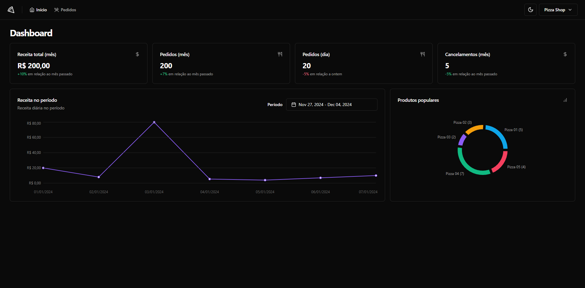
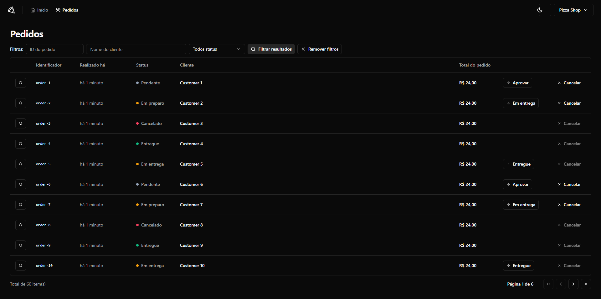

<h1 align="center">🍕 Pizza.shop Dashboard 📊</h1>




<p align="justify">Dashboard para lojistas que possuem um restaurante dentro de um aplicativo de delivery acompanharem suas métricas.</p>

> Status do Projeto: Concluído ✅

> Deploy disponível: Não ❌

## 🏆 Principais funcionalidades
- Login com Magic Link.
  - o usuário fornece seu e-mail para fazer login e recebe um link único enviado diretamente para seu e-mail. Esse link, quando clicado, autentica o usuário sem a necessidade de digitar uma senha.
- Filtragem e alteração de status do pedido.
  - na página de pedidos é possível filtrá-los por ID, nome do cliente e status. Bem como, alterar o status dos pedidos e obter mais detalhes sobre cada um.
- Outros:
   - É possível visualizar a aplicação sem necessariamente ter um back-end rodando, graças aos moks feitos com o Mock Service Worker.
   - O projeto conta com testes unitários e E2E feitos com jest, Testing Library e Playwright.

## 📚 Linguagens e libs utilizadas

- [React](https://reactjs.org/) 
- [TypeScript](https://www.typescriptlang.org/) 
- [React Router](https://reactrouter.com/en/main) 
- [React Hook Form](https://www.react-hook-form.com/)
- [Zod](https://zod.dev/)
- [Shadcn/ui](https://ui.shadcn.com/)
- [Jest](https://jestjs.io/pt-BR/)
- [Testing Library](https://testing-library.com/)
- [Mock Service Worker](https://mswjs.io/)

<!-- ## 🌐 Deploy da Aplicação com Netlify 

> https://club-ecommerce.netlify.app/
-->

## ▶️ Como rodar a aplicação 

No terminal, clone o projeto:
```bash
git clone https://github.com/Viniciusrbr/Pizza.shop-Dashboard.git
```

Entre na pasta do projeto:
```bash
cd Pizza.shop-Dashboard
```

Instale as dependências:
```bash
npm install
```

Execute a aplicação:
```bash
npm run dev:test
```

Pronto, agora é possível acessar a aplicação a partir da rota http://localhost:50789/
